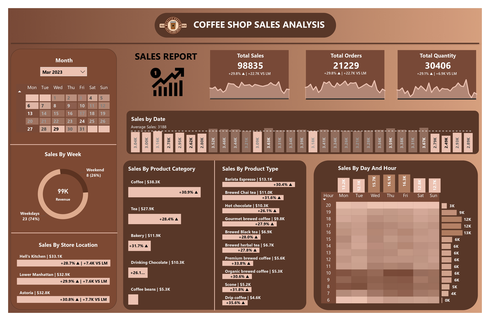

# ☕ Coffee Sales Analytics Dashboard

## 📝 Overview
The Coffee Sales Analytics Dashboard is a Power BI project designed to visualize sales data for a local coffee shop chain. It highlights key performance indicators (KPIs) such as total sales, total orders, and total quantity sold, with detailed insights by product category, product type, store location, and sales trends over time. This dashboard helps stakeholders analyze sales patterns, identify top-performing products, and optimize business operations.

## 📊 Dataset
- **transaction_id**: Unique identifier for each transaction.
- **transaction_date**: Date of the transaction.
- **transaction_time**: Time of the transaction.
- **transaction_qty**: Quantity of items sold in the transaction.
- **store_id**: Unique identifier for the store.
- **store_location**: Location of the store.
- **product_id**: Unique identifier for the product.
- **unit_price**: Price per unit of the product.
- **product_category**: Category of the product.
- **product_type**: Type of product within the category.
- **product_detail**: Specific details of the product.

### 🧮 DAX Formulas
- **Key Metrics and Formulas**:
    - **Total Sales**: Sum of sales revenue for the selected period.
        - Formula: `SUM(Transactions[Sales])`
    - **Total Orders**: Total number of distinct orders placed.
        - Formula: `DISTINCTCOUNT(Transactions[transaction_id])`
    - **Total Quantity Sold**: Total number of units sold.
        - Formula: `SUM(Transactions[Transaction_Qty])`
    - **Average Sales**: Average daily sales amount.
        - Formula: `AVERAGEX(ALLSELECTED(Transactions[transaction_date]), 'Date Table'[Total Sales])`
    - **Previous Month Sales**: Sales in the previous month.
        - Formula: `CALCULATE('Transactions'[CM], DATEADD('Date Table'[Date], -1, MONTH))`
    - **Previous Month Orders**: Number of orders in the previous month.
        - Formula: `CALCULATE('Transactions'[CM Orders], DATEADD('Date Table'[Date], -1, MONTH))`
    - **Previous Month Quantity Sold**: Quantity sold in the previous month.
        - Formula: `CALCULATE('Transactions'[CM Qty], DATEADD('Date Table'[Date], -1, MONTH))`
    - **Current Month Sales**: Sales for the selected month.
        - Formula:
            ```DAX
            VAR selected_month = SELECTEDVALUE('Date Table'[Month])
            RETURN TOTALMTD(
                CALCULATE(SUM(Transactions[Sales]), 'Date Table'[Month] = selected_month),
                'Date Table'[Date]
            )
            ```

## 🖥️ Dashboard Components
The dashboard includes:
- **Month Filter**: Dropdown to select the analysis period.
- **KPIs**:
    - Total sales, orders, and quantity sold with month-over-month comparisons.
- **Sales by Date**: Line chart showing daily sales trends with an average sales line.
- **Sales by Week**: Donut chart showing the split between weekdays and weekends.
- **Sales by Product Category**:
    - Bar chart displaying sales across categories like coffee, tea, bakery, etc.
- **Sales by Product Type**:
    - Detailed breakdown of sales by specific product types.
- **Sales by Store Location**:
    - Comparison of sales across different store locations with month-over-month differences.
- **Sales by Day and Hour**:
    - Heatmap showing sales patterns across days of the week and hours of the day.

## 📈 Dashboard



## 📬 Contact

For questions, feedback, or collaboration, please contact:

- **Name:** Ayushi Dhariwal  
- **Email:** ayushichoudhary141@gmail.com  
- **LinkedIn:** [linkedin.com/in/Ayushi-2811](https://www.linkedin.com/in/Ayushi-2811/)
